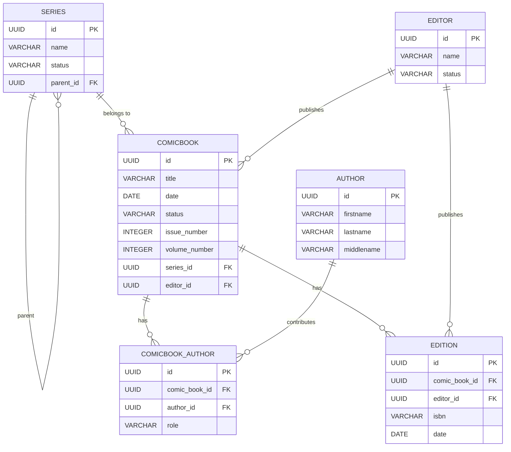

# Technical Documentation

## Entity Relationship Diagram

```mermaid
erDiagram
    SERIES {
        UUID id PK
        VARCHAR name
        VARCHAR status
        UUID parent_id FK
    }
    EDITOR {
        UUID id PK
        VARCHAR name
        VARCHAR status
    }
    COMICBOOK {
        UUID id PK
        VARCHAR title
        DATE date
        VARCHAR status
        INTEGER issue_number
        INTEGER volume_number
        UUID series_id FK
        UUID editor_id FK
    }
    AUTHOR {
        UUID id PK
        VARCHAR firstname
        VARCHAR lastname
        VARCHAR middlename
    }
    COMICBOOK_AUTHOR {
        UUID id PK
        UUID comic_book_id FK
        UUID author_id FK
        VARCHAR role
    }
    EDITION {
        UUID id PK
        UUID comic_book_id FK
        UUID editor_id FK
        VARCHAR isbn
        DATE date
    }

    SERIES ||--o{ SERIES : "parent"
    SERIES ||--o{ COMICBOOK : "belongs to"
    EDITOR ||--o{ COMICBOOK : "publishes"
    COMICBOOK ||--o{ COMICBOOK_AUTHOR : "has"
    AUTHOR ||--o{ COMICBOOK_AUTHOR : "contributes"
    COMICBOOK ||--o{ EDITION : "has"
    EDITOR ||--o{ EDITION : "publishes"
```
